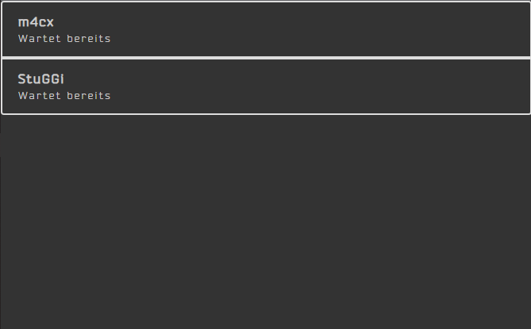
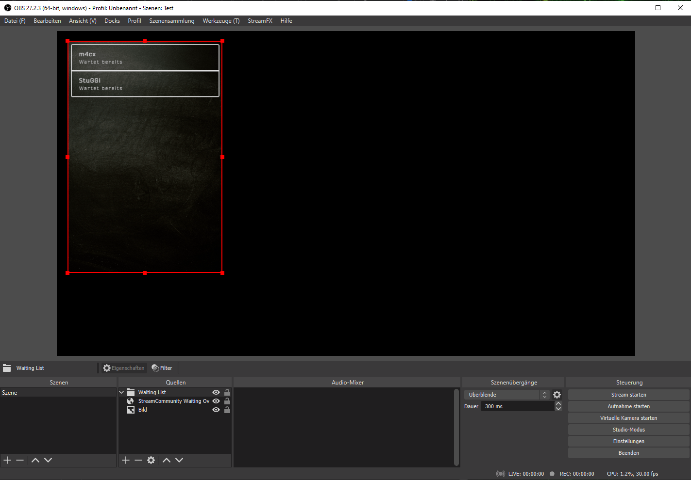

# Overlay

The overlay page is available under [`http://localhost:5000/#/overlay`](http://localhost:5000/#/overlay) and currently displays the list of waiting viewers only.

## Integration into OBS or other Tools

You can use a simple browser source object to integrate it into your stream setup. The overlay itself is delivered with a transparent background, so that you can place it on a neat background. We recommend a dark an background to guarantee a good readability for your viewers. In order to fit into several forms, the list should align well on different widths and heights. Give us a ping, if it does not work well for you.

