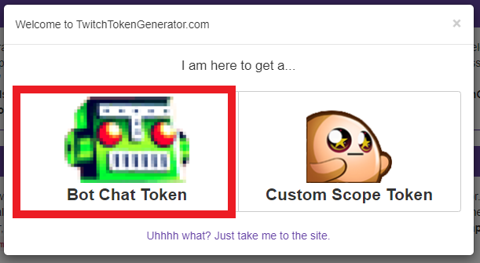

# Getting started

## Download

Download the latest preview version for your OS from [Github](https://github.com/m4cx/stream-community/releases). Currently we only support win-x64. This is to be extended very soon.

## Installation

We provide the software release in a zipped-format with no automatic installer. Just unzip the downloaded package to a destination of your choice. 

## Configuration

### Authentication

In this current stage no authentication method for external services is integrated into this software. All the third party accesses can be configured using `appsettings.json` in the root directory of the software.

#### Twitch

In order to get access to the Twitch-API you need to create an access-token. As long as this generation is not integrated in this software (which will happen along the way) you need to leverage external services for this.

We recommend using [Twitch Token Generator by swiftyspiffy](https://twitchtokengenerator.com/).

For now you just need to create a "Bot Chat Token". When first entering the page in the link you are presented a quick action to accomplish this.


After selecting "Bot Chat Token" you need to grant access for your currently logged in user in [twitch.tv](https://twitch.tv). The user you grant access here, will be the used user for generated chat messages. This user will interact as a bot with your users in the twitch chat.

> **Important**
> 
> Treat the generated token as it was a personal password. Anyone who gets access to this token will be able to act in a twitch chat on behalf of you. If you don't need 
> this token anymore, you need to revoke it in twitch. Of course this service is also provided by the token generator.

In order to securely passing this access token to the Stream Community software we use environment variables, as long as you can assume your whole system is safe.

| Environment Variable                      |
| ----------------------------------------- |
| `TwitchCommunity__Connector__AccessToken` |  |

In order to set this variable permanently for every use, you need to execute this command on an elevated command prompt (Run as Administrator):

```cmd
SETX TwitchCommunity__Connector__AccessToken "<paste-access-token-value-between-quotes>"
```

For other options to set environment variables in Windows just have a look at [this help article](https://www.computerhope.com/issues/ch000549.htm).

## Start the software

In order to start the software you need execute `StreamCommunity.Host.exe`.

## Management UI

The management UI will afterwards be available under the URL [http://localhost:5000](http://localhost:5000)